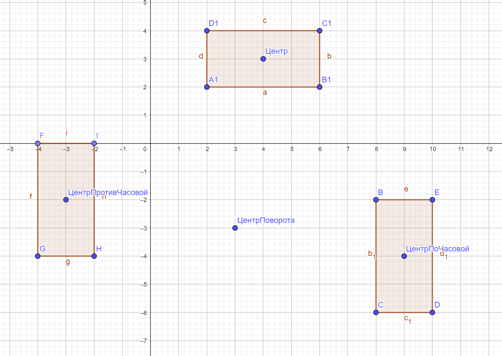

Используя как основу [проект](https://github.com/ipetrushin/Figures), дополните классы Rect, Circle, Square необходимой функциональностью:

- реализуйте интерфейс Transforming
- реализуйте интерфейс Movable
- осуществите наследование от Figure

В классе Main проверьте работоспособность методов: поворот, перемещение и масштабирование фигур.

Иллюстрация к повороту:

[Файл вывода](out.txt)